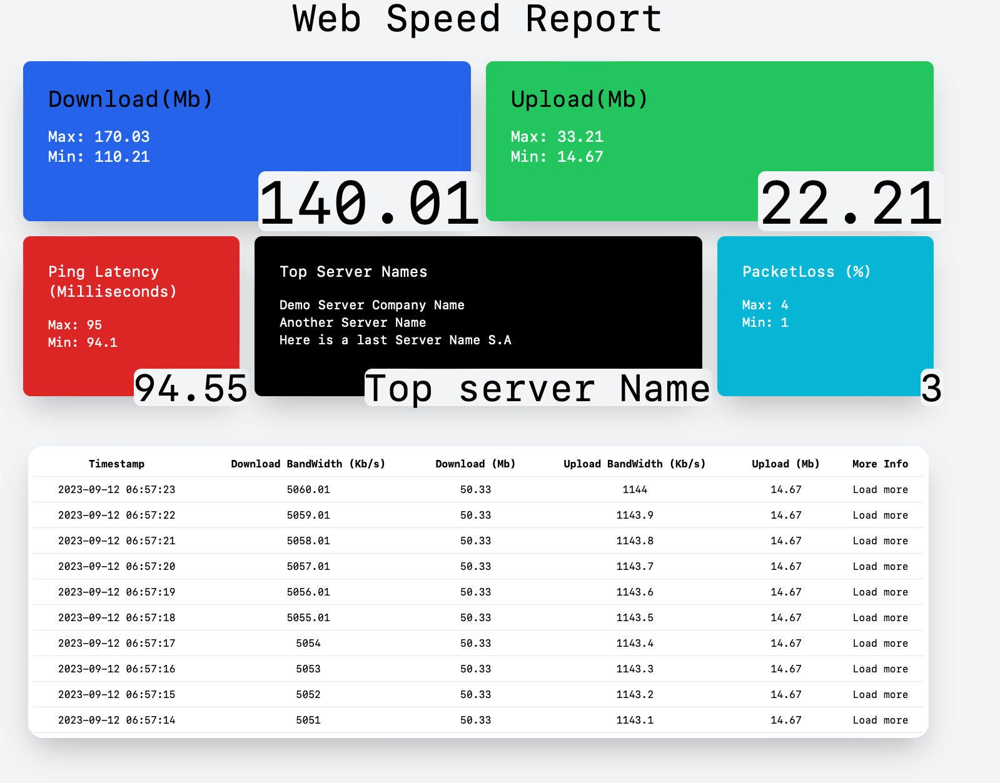
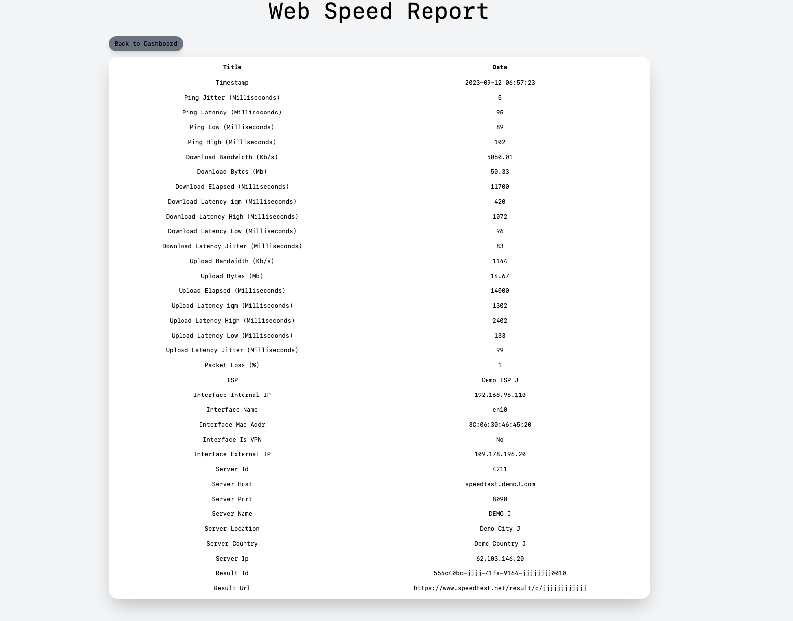

<h1>WebSpeedReport</h1>

WebSpeedReport it's an <b>open source tool</b> that provides more in depth information about your internet connection.

<ul><b>Features:</b>
    <li>It utilises SpeedTest from Ookla.</li>
    <li>Helps you set cron-jobs to run speedtests in the background.</li>
    <li>Gives you an overall view of your data in a dashboard.</li>
    <li>Provides an in-depth view from your internet test runs.</li>
</ul>

<h3>Notice of Usage of Speedtest® by Ookla® in Open Source Projects</h3>

In this open source project, we incorporate the use of Speedtest CLI provided by Ookla®. We acknowledge and respect Ookla® and its contributors' rights to the Speedtest® technology.

The Speedtest CLI tool allows users to test internet performance metrics, and this is utilized in our project to provide users with insights into their internet connectivity.

Our use of Speedtest CLI is in accordance with its licensing terms. We do not claim any ownership or rights over the Speedtest technology, logo, or other related properties, and all respective rights remain with Ookla®.

All users and contributors of this open source project are advised to review Ookla's terms of service and any related licensing agreements to ensure compliance when integrating or working with Speedtest technology.

Please support the original creators by visiting Ookla's official website for Speedtest: https://www.speedtest.net/

If there are any concerns or copyright issues, please contact george_bak'at'proton.me to address them promptly.
